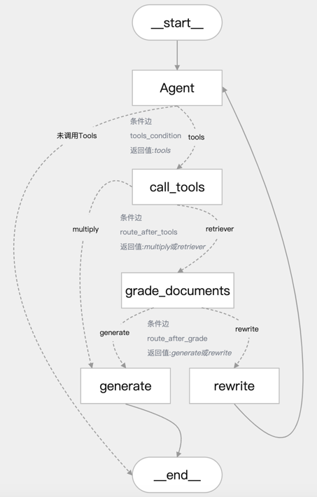

# 项目介绍

本项目实现了一个基于状态图的对话流程，通过分析用户输入、调用工具和生成回复，提供流畅的交互体验。以下是其核心工作流程：

1. 用户输入问题后，进入 **agent 分诊节点**，进行意图分析。
2. 若需调用工具，则路由到 **call_tools 节点**，并行执行工具调用；否则直接生成回复并结束流程。
3. 根据工具类型：
   - 若为检索类工具，进入 **grade_documents 节点** 进行相关性评分。若评分相关，则路由到 **generate 节点** 生成回复；否则最多重写（rewrite）3次。
   - 若为非检索类工具，直接路由到 **generate 节点** 生成回复。
4. 最终回复生成后，输出至用户。

流程图如下：<br>


## 核心功能

1. **基于状态图的对话流程**
   - 定义了包含多个节点（Node）和边（Edge）的对话工作流：
     - **agent**：分析用户问题并决定是否调用工具。
     - **call_tools**：并行执行工具调用。
     - **grade_documents**：评估检索到的文档与问题的相关性。
     - **rewrite**：重写用户查询以改进问题。
     - **generate**：生成最终回复。
   - **动态路由**：
     - **route_after_tools**：根据工具调用结果决定下一步是生成回复还是评分文档。
     - **route_after_grade**：根据文档相关性评分决定生成回复还是重写查询。

2. **工具调用与并行处理**
   - 通过 **ToolConfig** 类管理工具列表和路由配置，支持动态路由。
   - 使用 **ParallelToolNode** 并行执行多个工具调用，提高效率，支持最大工作线程数配置（默认为 5）。

3. **数据库与持久化存储**
   - 使用 **ConnectionPool** 管理 PostgreSQL 数据库连接，支持自动提交、超时设置和连接池状态监控。
   - 支持线程内持久化（对话状态检查点）和跨线程持久化（用户记忆存储）。
   - 使用 **tenacity** 库实现数据库操作重试机制（最多 3 次，指数退避等待）。

4. **自然语言处理与提示模板**
   - 使用 **get_llm** 获取聊天模型和嵌入模型。
   - 提供提示模板管理，支持结构化输出。
   - 支持消息过滤，限制历史消息保留数量（最多 5 条）。

5. **日志与错误处理**
   - 使用 **logging** 模块记录详细日志（DEBUG 级别），支持文件轮转（5MB，3 个备份）。
   - 提供多层次异常捕获机制，记录错误并提供默认路由或提示用户。

6. **用户交互与响应输出**
   - 实现交互式对话主循环，支持退出命令（如 `quit`、`exit`、`q`）。
   - 区分工具输出（显示工具名称）和大模型输出（普通回复），提升用户体验。

7. **辅助功能**
   - 提供状态图可视化功能，便于调试。
   - 使用 **Config** 类统一管理日志文件路径、数据库 URI、提示模板路径等配置。

## 安装项目依赖

在命令行终端中运行以下命令安装项目依赖：

```bash
pip install langchain-community==0.3.19
pip install langchain-chroma==0.2.2
pip install pdfminer
pip install pdfminer.six
pip install nltk==3.9.1
pip install psycopg2==2.9.10
pip install concurrent-log-handler==0.9.25
```

## 项目运行

### 1. 启动数据库

- PostgreSQL 的 Docker 配置文件为 `docker-compose.yml`。
- 运行以下命令后台启动 PostgreSQL 数据库服务：
  ```bash
  docker-compose up -d
  ```
- 若需要删除容器，运行以下命令：
  ```bash
  docker-compose down --volumes
  ```
- 由于 LangGraph 的 PostgresStore 需要使用 pgvector，需在容器中执行以下步骤：
  ```bash
  apt update
  apt install -y git build-essential postgresql-server-dev-15
  git clone --branch v0.7.0 https://github.com/pgvector/pgvector.git
  cd pgvector
  make
  make install
  ```
- 验证安装是否成功：
  ```bash
  ls -l /usr/share/postgresql/15/extension/vector*
  ```
  接下来，若要在脚本中进行使用，首先在系统环境中需要安装PostgreSQL 的开发库（libpq），因为 psycopg 需要它来编译或运行,根据自己的操作系统选择进行安装 

- 安装系统依赖：
  - **MacOS**: 使用 Homebrew 安装 PostgreSQL 开发库：
    ```bash
    brew install postgresql
    ```

- 安装相关依赖包：
  ```bash
  pip install langgraph-checkpoint-postgres
  pip install psycopg psycopg-pool
  ```
  同时，使用数据库客户端软件远程登陆进行可视化操作，这里使用Navicat客户端软件

### 2. 知识库构建

运行以下脚本进行文档加载、切分、向量化和灌入向量数据库：
```bash
python vectorSaveTest.py
```

### 3. 测试

在运行 `demoRagAgent.py` 脚本前，请根据实际情况调整代码中的大模型配置参数。

### 4. 运行

1. 在运行 `main.py` 脚本前，请根据实际情况调整以下配置：
   - `llms.py` 中的大模型配置参数。
   - `main.py` 中的服务 IP 和 PORT，以及 LangSmith 平台的 API KEY。

2. 在运行 `webUI.py` 脚本前，请根据实际情况调整以下配置：
   - 是否启用流式输出（`stream_flag = False` 或 `True`）。
   - 检查 URL 地址中的 IP 和 PORT 是否与 `main.py` 中一致。

3. 运行成功后，直接打开 URL 地址，在浏览器端进行交互测试。


